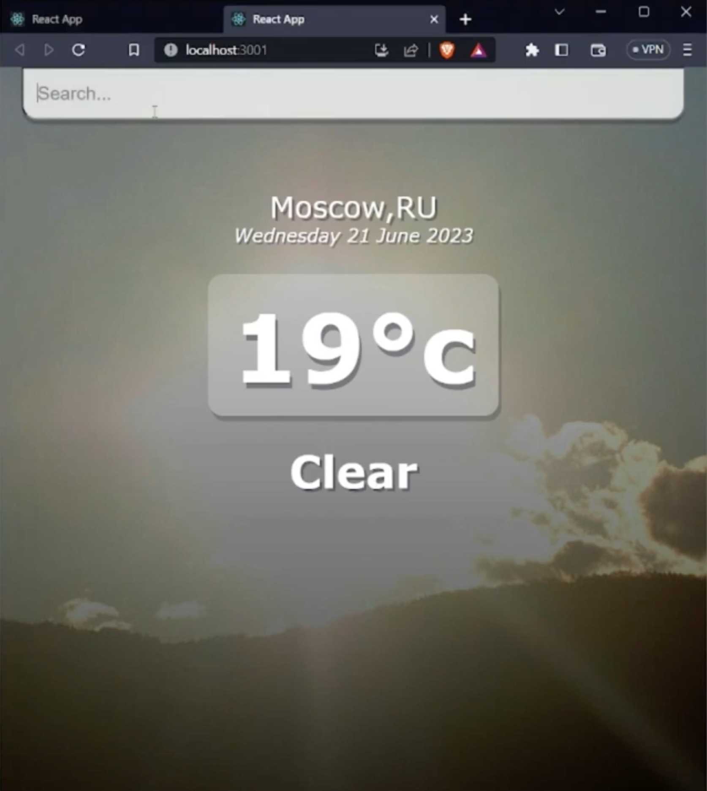
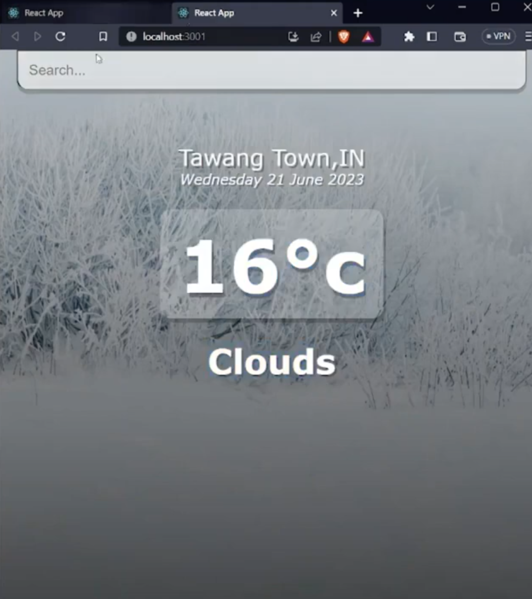

# Weather-App-ReactJS

• Developed a responsive weather application using the MERN stack that provides real-time updates and a 5-day forecast.

• Utilized external APIs and geolocation services to fetch and display accurate weather data.

  
  

